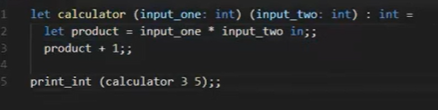
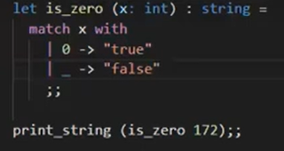
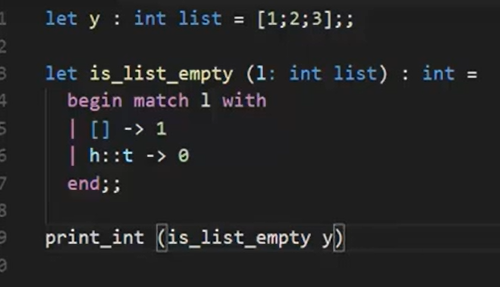
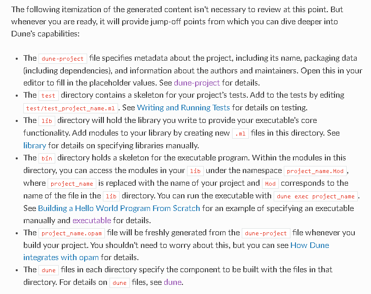
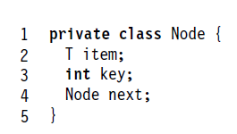

# OCaml Notes for Me

## Functions

- Function definitions at top and bottom you call them
- if you have recursion put rec in the function declaration

1. in basically mentions that it is in the same scope as the function itself , without the in it would state that its a syntax error
2. let declares a variable under the function name

### Pattern Matching

- match checks variable and outputs res based on input
- "\_" symbol is a wildcat and is used for else kindoff

- h= head of list and t=tail h::t

## Compile

- ocamlc -o plainlinkedlist plainlinkedlist.ml
  ./plainlinkedlist or ocamlrun
- ocamlopt -o plainlinkedlist plainlink
  edlist.ml
  ./plainlinkedlist

## Variables

- let .. assigns variable
  if i do apoel = 6 it checks it doesnt assign it (bool)
- list called x with integers
  
  1::[2;3] appends 1 to the list

#### Dune

#### Art of Multiprocessor Programming notes

- Remove (x) does and returns true if was there
- Add (x) does and returns true if not there
- Contains (x) true if set containse

Node :

2 types of nodes:

- Nodes from image
- Sentinel Nodes (1st and last),cant be removed keys minimun and maximum values

- Each thread has 2 local variables to traverese , curr and pred

- Nodes are sorted by key and keys are unique

Points to mention in my thesis:

- Explain each approach /their main differences
- Mention linearization point for each

utop Path:
#use "/mnt/d/Groningen/Year 3/Thesis/Coding/MulticoreOCamlThesis/CoarseGrained/bin/LinkedList.ml";;

Latest Notes of meeting with Dan :

- Add Read.me mentioning specifications and ocaml version etc etc
- Change the barrier so it doesnt do it every iteration maybe just in the beggingin
- implement mli files for each
- implement a generic testing
- check out saturn bennchmarking
- implement lock free synchronization
- refactor
