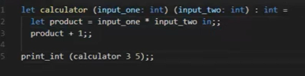
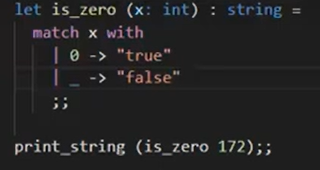
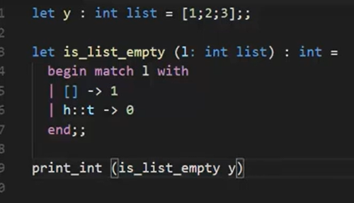
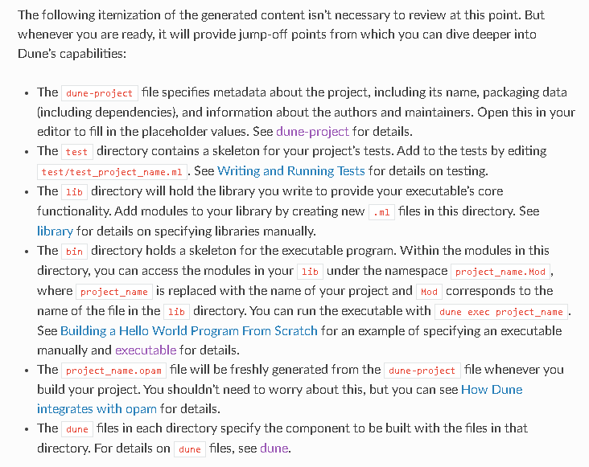
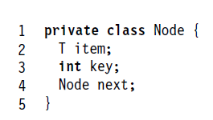
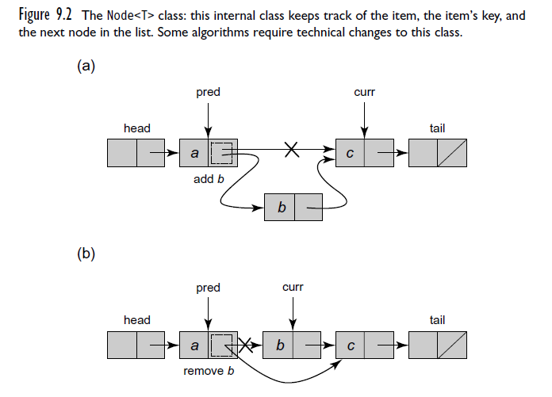

# OCaml Notes for Me

## Functions

- Function definitions at top and bottom you call them
- if you have recursion put rec in the function declaration

1. in basically mentions that it is in the same scope as the function itself , without the in it would state that its a syntax error
2. let declares a variable under the function name

### Pattern Matching

- match checks variable and outputs res based on input
- "\_" symbol is a wildcat and is used for else kindoff

- h= head of list and t=tail h::t

## Compile

- ocamlc -o plainlinkedlist plainlinkedlist.ml
  ./plainlinkedlist or ocamlrun
- ocamlopt -o plainlinkedlist plainlink
  edlist.ml
  ./plainlinkedlist

## Variables

- let .. assigns variable
  if i do apoel = 6 it checks it doesnt assign it (bool)
- list called x with integers
  
  1::[2;3] appends 1 to the list

#### Dune

#### Art of Multiprocessor Programming notes

- Remove (x) does and returns true if was there
- Add (x) does and returns true if not there
- Contains (x) true if set containse

Node :

2 types of nodes:

- Nodes from image
- Sentinel Nodes (1st and last),cant be removed keys minimun and maximum values

- Each thread has 2 local variables to traverese , curr and pred

- Nodes are sorted by key and keys are unique

Points to mention in my thesis:

- Explain each approach /their main differences
- Mention linearization point for each

utop Path:
#use "/mnt/d/Groningen/Year 3/Thesis/Coding/MulticoreOCamlThesis/CoarseGrained/bin/CoarseGrained.ml";;
#use "/mnt/d/Groningen/Year 3/Thesis/Coding/MulticoreOCamlThesis/Multicore_Benchmarking/bin/LockFreeCAS.ml";;
Latest Notes of meeting with Dan :

- implement a generic testing
- check out saturn bennchmarking
- implement lock free synchronization
- refactor
- fIGURE OUT COMPILING
  Thesis points worthy mentioning :

#### Lockfree understanding

- Removing

1.  Thread A logically removes currA by setting the mark bit in the node’s next
2.  thread traverses the list, it cleans up the list by physically
    removing (using compareAndSet()) any marked nodes it encounters.

- Windows class
  The Window class’s find() method takes a head node and a key
  a, and traverses the list, seeking to set pred to the node with the largest key less
  than a, and curr to the node with the least key greater than or equal to a.

- lockfree
- Refactor main pass method make it look nicer , have like a commonbench and f num domains type of vibe
- make it work on same data
- look at saturn and the other benchmarking
